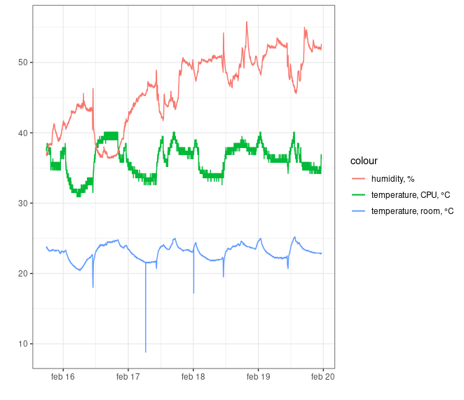
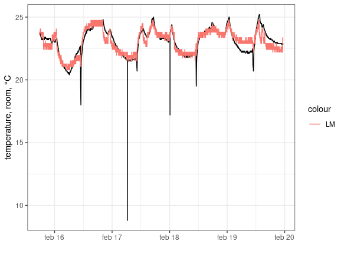
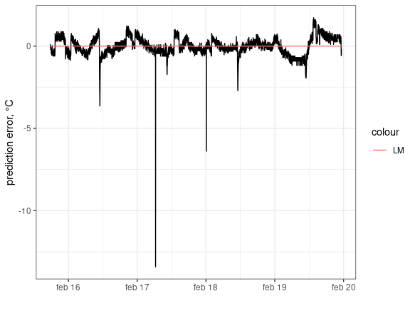

# RPi Temperature data

I got a new aluminium heat sink case for my Raspberry Pi 2 Model B. Then, I installed a DHT22 temperature and humidity sensor. Now, every minute for 5 days some readings were recorded:

* room's temperature (Celsius), sensed by the DHT22,
* relative humidity (%), also sensed by the DHT22,
* internal CPU temperature (Celsius).

Feel free to experiment any method you like, in order to practice or to make other people practice. Can you predict the room's temperature in the short term, so that I can lower the sampling frequency by a significant amount, say, down to just 1 reading per hour? Can you explain your solution in simple terms?

It's a humid environment, as you'll see. Around 10 a.m. every day, I open my room's window, so both temperature and humidity will shift a bit. Is there a way to automatically detect these outliers? Which smoothing methods can work reliably even without removing the outliers?

Also, there are very few variables. Can you do enough with so little? Choose whether to use all the variables or just the time and the room's temperature.

(Maybe it's not important, but the readings are scheduled at times HH:MM:00, yet it takes few seconds to sense and record data. This amount of time may depend on concurrent activity, which may cause heating?)

Have fun.

## Baseline model

The baseline, the placebo-level model, is the linear model for the room's temperature versus just the CPU's temperature. You see the fit is pretty good:

So the linear model makes a pretty decent work: it gets the room's temperature up to a *substantially negligible* error, as personally I just cannot notice a temperature shift about 2 degrees.

Moreover, the linear model, though not inherently robust, suffices here in filtering out all morning outliers.

But you see, the prediction error persists over time, as positive errors lead to subsequent positive errors, the same for negative errors, due to a likely auto-regressive process. So, can a time series model reduce the error further? This can be an exercise for practitioners.
